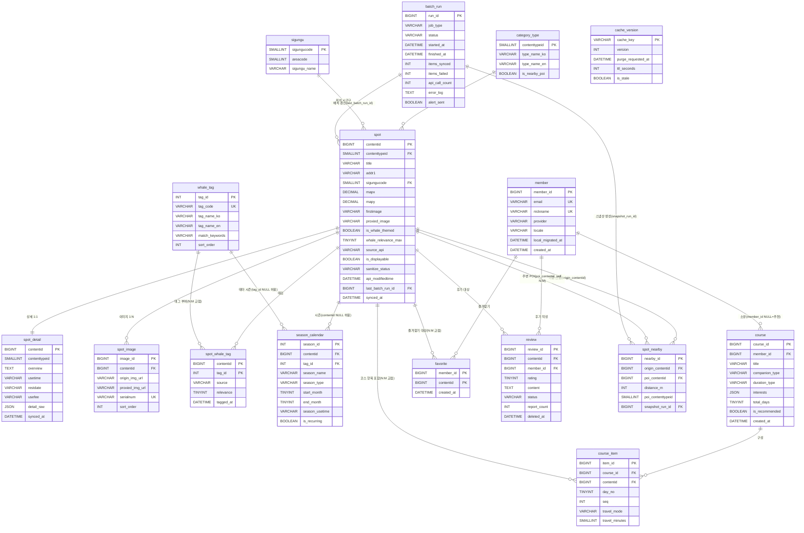

# ERD (데이터 모델)

> 주: Mermaid 가독성을 위해 일부 보조 컬럼은 다이어그램에서 생략했으며, 전체 컬럼은 아래 속성 표를 기준으로 한다. cache_version은 캐시 무효화 메타로 다른 엔티티와 직접 FK 관계가 없는 독립 참조 테이블이다.

## 엔티티별 속성

### spot — 스팟 마스터(캐시 허브)
TourAPI areaBasedList2(areaCode=7) 전수 수집 결과를 caching. 음식점/카페/숙박 포함 모든 콘텐츠를 contenttypeid로 구분(별도 테이블 미분리).

| 필드 | 타입 | 키 | 비고 |
|---|---|---|---|
| contentid | BIGINT | PK | TourAPI 콘텐츠 ID를 그대로 PK 사용 |
| contenttypeid | SMALLINT | FK | category_type 참조. 12/14/15/25/39/32 구분 |
| title | VARCHAR(255) | | 스팟 명칭 |
| addr1 | VARCHAR(255) | | 기본 주소 |
| addr2 | VARCHAR(255) | | 상세 주소(선택) |
| areacode | SMALLINT | | 항상 7(울산) |
| sigungucode | SMALLINT | FK | sigungu 참조 |
| mapx | DECIMAL(10,7) | | 경도(GPS X) |
| mapy | DECIMAL(10,7) | | 위도(GPS Y) |
| firstimage | VARCHAR(500) | | 대표 썸네일 URL |
| firstimage2 | VARCHAR(500) | | 대표 썸네일(소형) URL |
| proxied_image | VARCHAR(500) | | 프록시/정규화 안정 URL(NULL이면 플레이스홀더) |
| tel | VARCHAR(100) | | 전화번호 |
| cat1/cat2/cat3 | VARCHAR(10) | | 대/중/소분류 코드(카페는 음식점 cat3 흡수) |
| is_whale_themed | BOOLEAN | | searchKeyword2 1차 플래그. whale_relevance_max>=임계치 동기화 |
| whale_relevance_max | TINYINT | | spot_whale_tag.relevance 최대값 캐시(0-100) |
| source_api | VARCHAR(40) | | 데이터 출처 식별(내부용, UI 노출 금지) |
| is_displayable | BOOLEAN | | UI 노출 가능 여부(정제 실패 시 false) |
| sanitize_status | VARCHAR(20) | | clean/sanitized/flagged. 공사 명칭 혼입 시 flagged |
| api_modifiedtime | DATETIME | | TourAPI modifiedtime. 증분 갱신 판단 |
| last_batch_run_id | BIGINT | FK | batch_run 참조. 마지막 갱신 배치 |
| synced_at | DATETIME | | 마지막 캐시 동기화 시각 |

### spot_detail — 스팟 상세(1:1)
detailCommon2/detailIntro2 응답. 무거운 텍스트 분리.

| 필드 | 타입 | 키 | 비고 |
|---|---|---|---|
| contentid | BIGINT | PK | spot 1:1 참조(PK 겸 FK) |
| contenttypeid | SMALLINT | | 타입별 파싱 분기용 중복 보관 |
| overview | TEXT | | 개요. 공사 명칭 혼입 검사 대상 |
| homepage | VARCHAR(500) | | 홈페이지 URL |
| zipcode | VARCHAR(10) | | 우편번호 |
| usetime | VARCHAR(500) | | 이용/운영 시간(정규화) |
| restdate | VARCHAR(255) | | 휴무일 |
| usefee | VARCHAR(500) | | 이용 요금/입장료 |
| parking | VARCHAR(255) | | 주차 정보 |
| infocenter | VARCHAR(255) | | 문의/안내 연락처 |
| detail_raw | JSON | | 타입별 가변 필드 원본 보존 |
| synced_at | DATETIME | | 상세 동기화 시각 |

### spot_image — 추가 이미지 갤러리(1:N)
detailImage2 응답.

| 필드 | 타입 | 키 | 비고 |
|---|---|---|---|
| image_id | BIGINT | PK | 자체 증분 PK |
| contentid | BIGINT | FK | spot 참조 |
| origin_img_url | VARCHAR(500) | | 원본 이미지 URL |
| small_img_url | VARCHAR(500) | | 썸네일 URL |
| proxied_img_url | VARCHAR(500) | | 프록시/정규화 안정 URL(폴백) |
| img_name | VARCHAR(255) | | 이미지 설명/명칭 |
| serialnum | VARCHAR(100) | UK | (contentid, serialnum) 복합 유니크 |
| sort_order | INT | | 갤러리 표시 순서 |
| synced_at | DATETIME | | 동기화 시각 |

### whale_tag — 고래 테마 태그 마스터
행정구역이 아닌 고래 테마 기반 조직의 핵심 참조 테이블.

| 필드 | 타입 | 키 | 비고 |
|---|---|---|---|
| tag_id | INT | PK | 태그 고유 ID |
| tag_code | VARCHAR(50) | UK | 슬러그(jangsaengpo/bangudae/whale_cruise) |
| tag_name_ko | VARCHAR(100) | | 태그 한글명 |
| tag_name_en | VARCHAR(100) | | 태그 영문명(다국어 후순위) |
| match_keywords | VARCHAR(255) | | searchKeyword2 자동 태깅 키워드(콤마) |
| description | VARCHAR(500) | | 태그 설명 |
| sort_order | INT | | 여지도 UI 노출 순서 |

### spot_whale_tag — 스팟↔태그 N:M 조인

| 필드 | 타입 | 키 | 비고 |
|---|---|---|---|
| contentid | BIGINT | PK, FK | spot 참조. (contentid, tag_id) 복합 PK |
| tag_id | INT | PK, FK | whale_tag 참조 |
| source | VARCHAR(20) | | keyword(자동)/manual(큐레이션) |
| relevance | TINYINT | | 적합도 점수(0-100). 변경 시 spot 비정규화 재계산 |
| tagged_at | DATETIME | | 태깅 시각 |

### season_calendar — 시즌·운영 캘린더
고래바다여행선(4~10월)·태화강 야경·억새 등.

| 필드 | 타입 | 키 | 비고 |
|---|---|---|---|
| season_id | INT | PK | 시즌 항목 ID |
| contentid | BIGINT | FK | spot 참조(NULL=전역 시즌) |
| tag_id | INT | FK | whale_tag 참조(NULL=테마 단위) |
| season_name | VARCHAR(100) | | 시즌명 |
| season_type | VARCHAR(30) | | operation/scenery/festival |
| start_month / end_month | TINYINT | | 시작/종료 월(반복형) |
| start_date / end_date | DATE | | 특정 연도 일자(비반복형, 선택) |
| season_usetime | VARCHAR(500) | | 시즌별 운영시간(spot_detail.usetime 오버라이드) |
| is_recurring | BOOLEAN | | 매년 반복 여부 |
| note | VARCHAR(500) | | 운영 비고(CHECK 제약 명시) |

### member — 회원 (Phase2)
MVP(무인증·localStorage)에서는 미사용, Phase2 인증 도입 시 활성.

| 필드 | 타입 | 키 | 비고 |
|---|---|---|---|
| member_id | BIGINT | PK | 회원 ID |
| email | VARCHAR(255) | UK | 로그인 이메일 |
| password_hash | VARCHAR(255) | | 비밀번호 해시(소셜 시 NULL) |
| nickname | VARCHAR(50) | UK | 표시 닉네임 |
| provider | VARCHAR(20) | | local/kakao/naver/google |
| profile_image | VARCHAR(500) | | 프로필 이미지(선택) |
| locale | VARCHAR(10) | | 선호 언어(ko/en) |
| local_migrated_at | DATETIME | | localStorage→서버 이관 시각(NULL=미이관) |
| created_at / updated_at | DATETIME | | 가입/수정 시각 |

### course — 추천/저장 코스
member_id NULL=시스템 추천 템플릿. MVP는 localStorage, Phase2 서버 영속화.

| 필드 | 타입 | 키 | 비고 |
|---|---|---|---|
| course_id | BIGINT | PK | 코스 ID |
| member_id | BIGINT | FK | member 참조(NULL=추천 템플릿) |
| title | VARCHAR(200) | | 코스 제목 |
| companion_type | VARCHAR(20) | | family/couple/friends/solo |
| duration_type | VARCHAR(20) | | day/1n2d/2n3d |
| interests | JSON | | 관심사 배열(v1 가중치 입력) |
| total_days | TINYINT | | 총 일수(1/2/3) |
| is_recommended | BOOLEAN | | 시스템 자동 생성 여부 |
| is_public | BOOLEAN | | 공개/공유 여부 |
| cover_image | VARCHAR(500) | | 대표 이미지 |
| created_at / updated_at | DATETIME | | 생성/수정 시각 |

### course_item — 코스 구성 항목(N:M 조인)

| 필드 | 타입 | 키 | 비고 |
|---|---|---|---|
| item_id | BIGINT | PK | 항목 ID |
| course_id | BIGINT | FK | course 참조 |
| contentid | BIGINT | FK | spot 참조 |
| day_no | TINYINT | | 여행 일자. (course_id,day_no,seq) 복합 유니크 권장 |
| seq | INT | | 일자 내 방문 순서 |
| travel_mode | VARCHAR(20) | | walk/car/transit(추천 엔진 산출) |
| travel_minutes | SMALLINT | | 직전→본 항목 예상 이동시간(분) |
| memo | VARCHAR(500) | | 항목 메모 |
| planned_time | VARCHAR(20) | | 예정 방문 시간대(선택) |

### favorite — 즐겨찾기(N:M)
MVP는 localStorage `{contentid, created_at}`, Phase2 본 테이블 이관.

| 필드 | 타입 | 키 | 비고 |
|---|---|---|---|
| member_id | BIGINT | PK, FK | member 참조. (member_id, contentid) 복합 PK |
| contentid | BIGINT | PK, FK | spot 참조 |
| created_at | DATETIME | | 추가 시각 |

### review — 후기·평점 (Stretch)
공개 시 모더레이션 동반 전제, 무인증 작성 시 경량 인증 가드 필요.

| 필드 | 타입 | 키 | 비고 |
|---|---|---|---|
| review_id | BIGINT | PK | 후기 ID |
| contentid | BIGINT | FK | spot 참조(대상) |
| member_id | BIGINT | FK | member 참조(작성자, 무인증 시 NULL 가능) |
| rating | TINYINT | | 평점 1-5. (member_id,contentid) 1인1리뷰 권장 |
| content | TEXT | | 후기 본문 |
| image_url | VARCHAR(500) | | 첨부 이미지(선택) |
| status | VARCHAR(20) | | visible/hidden/reported |
| report_count | INT | | 신고 누적(임계치 시 자동 hidden) |
| deleted_at | DATETIME | | 소프트삭제 시각(NULL=정상) |
| created_at / updated_at | DATETIME | | 작성/수정 시각 |

### spot_nearby — 주변 연계 스냅샷 캐시(spot self N:M)
평시 런타임 처리, 데모 사고 대비 핵심 스팟 주변 POI 영속 폴백.

| 필드 | 타입 | 키 | 비고 |
|---|---|---|---|
| nearby_id | BIGINT | PK | 자체 증분 PK |
| origin_contentid | BIGINT | FK | spot 참조(기준). (origin,poi) 복합 유니크 권장 |
| poi_contentid | BIGINT | FK | spot 참조(주변 POI) |
| distance_m | INT | | 거리(m) 캐싱 |
| poi_contenttypeid | SMALLINT | | POI 유형(39/32 등) |
| snapshot_run_id | BIGINT | FK | batch_run 참조 |
| synced_at | DATETIME | | 스냅샷 동기화 시각 |

### batch_run — 야간 배치 실행 이력
배치 성공·실패·롤백·헬스체크·쿼터 추적의 데이터 근거.

| 필드 | 타입 | 키 | 비고 |
|---|---|---|---|
| run_id | BIGINT | PK | 배치 실행 ID |
| job_type | VARCHAR(30) | | full_collect/incremental/detail/image/nearby_snapshot/season |
| status | VARCHAR(20) | | running/success/partial/failed/rolled_back |
| started_at / finished_at | DATETIME | | 시작/종료 시각(NULL=진행중) |
| items_synced / items_failed | INT | | 처리/실패 건수(부분 갱신 판단) |
| api_call_count | INT | | TourAPI 호출 누적(쿼터 추적) |
| retry_count | TINYINT | | 재시도 횟수 |
| error_log | TEXT | | 실패 원인/스택(알림 본문 소스) |
| alert_sent | BOOLEAN | | 실패 알림 발송 여부(중복 방지) |

### cache_version — 캐시 무효화 메타(출처 of truth)
키 버저닝·수동 퍼지·SWR 폴백 정책 근거.

| 필드 | 타입 | 키 | 비고 |
|---|---|---|---|
| cache_key | VARCHAR(100) | PK | 캐시 키/태그(spot:map:bbox 등) |
| version | INT | | 키 버전(큐레이션 변경 시 증가→무효화) |
| purge_requested_at | DATETIME | | 수동 퍼지 요청 시각(NULL=없음) |
| ttl_seconds | INT | | 키별 TTL(SWR 기준) |
| is_stale | BOOLEAN | | 강제 stale 플래그(배치 실패 폴백) |
| updated_at | DATETIME | | 버전/퍼지 갱신 시각 |

### category_type — contentTypeId 코드 마스터(참조)

| 필드 | 타입 | 키 | 비고 |
|---|---|---|---|
| contenttypeid | SMALLINT | PK | 12/14/15/25/39/32 |
| type_name_ko | VARCHAR(50) | | 한글 분류명 |
| type_name_en | VARCHAR(50) | | 영문 분류명(다국어) |
| is_nearby_poi | BOOLEAN | | 주변 연계·spot_nearby 스냅샷 대상 여부 |

### sigungu — 울산 시군구 코드(참조, 보조 메타)

| 필드 | 타입 | 키 | 비고 |
|---|---|---|---|
| sigungucode | SMALLINT | PK | 시군구 코드(필요 시 areacode 복합) |
| areacode | SMALLINT | | 항상 7(울산) |
| sigungu_name | VARCHAR(50) | | 시군구명(남구·중구·동구·북구·울주군) |

## 관계 설명

- **spot이 캐시 허브**: areaBasedList2 전수 수집을 contentid PK로 저장하고 spot_detail(1:1)·spot_image(1:N)으로 상세·이미지 분리. synced_at/api_modifiedtime으로 증분 갱신, last_batch_run_id로 갱신 배치 추적.
- **category_type 1:N spot / sigungu 1:N spot**: 음식점·카페·숙박은 별도 테이블 없이 contenttypeid(39/32)로 구분(카페는 39의 cat3 흡수). sigungu는 테마 우선이므로 보조 메타로만 보유(규칙 #3 행정구역 분류 금지 준수).
- **고래 테마 N:M**: whale_tag(마스터)+spot_whale_tag(조인). keyword 자동 태깅+manual 큐레이션을 relevance와 병행. spot.is_whale_themed/whale_relevance_max는 빠른 1차 필터용 비정규화로 동기화 재계산.
- **season_calendar**: spot·whale_tag 각각 1:N(둘 다 NULL이면 전역 시즌). is_recurring=true면 start_month/end_month, false면 start_date/end_date 필수(CHECK 제약 권장).
- **course 통합**: 추천(member_id NULL)과 저장 코스를 한 테이블로. course→course_item(1:N), spot→course_item(1:N)로 course↔spot N:M. course_item이 day_no+seq 동선, travel_mode+travel_minutes 구간 이동 표현.
- **favorite/review**: member·spot 각각 1:N. favorite는 (member_id,contentid) 복합 PK, review는 (member_id,contentid) 1인1리뷰·status·deleted_at 모더레이션.
- **spot_nearby**: spot 자기참조 N:M(origin_contentid/poi_contentid), batch_run snapshot_run_id로 스냅샷 추적.
- **batch_run / cache_version**: batch_run은 spot·spot_nearby를 1:N 갱신. cache_version은 캐시 무효화 단일 진실 출처로 직접 FK 없는 독립 참조.

## 노트

- **CRUD는 분할하지 않음**: 후기(리뷰) CRUD=review, 저장 코스 CRUD=course+course_item, 즐겨찾기 CRUD=favorite, 코스 항목 CRUD=course_item을 각각 단일 기능으로 취급.
- **컴플라이언스(규칙 #1)**: source_api는 내부 식별용으로 UI 노출 금지, 출처는 '공공데이터' 중립 표기. title·overview·이미지에 공사 표기 혼입 시 sanitize_status=flagged, is_displayable=false로 노출 차단.
- **이미지 안정성**: spot.proxied_image·spot_image.proxied_img_url로 만료·핫링크·http 혼합콘텐츠·404 대비, NULL이면 플레이스홀더 폴백.
- **MVP↔영속 브리지**: MVP는 무인증·localStorage. member/course/course_item/favorite/review 서버 테이블은 Phase2 활성. 로컬 스키마를 서버 테이블 형태와 일치 — favorite 로컬 `{contentid, created_at}`, course 로컬 `{title, companion_type, duration_type, interests, items:[{contentid, day_no, seq, travel_mode, travel_minutes}]}`. member.local_migrated_at으로 이관 추적.
- **복합 유니크/PK 권장**: spot_whale_tag(contentid,tag_id), favorite(member_id,contentid), course_item(course_id,day_no,seq), spot_image(contentid,serialnum), review(member_id,contentid), spot_nearby(origin_contentid,poi_contentid). 다국어는 *_en 컬럼+member.locale로 후순위 대비.
- **권장 DBMS**: PostgreSQL(좌표 GIST 인덱스로 거리 조회 유리, JSONB로 interests·detail_raw 지원) — 팀 역량 따라 MySQL 등 조정 가능. TINYINT/DATETIME은 MySQL 표기이며 PostgreSQL 적용 시 SMALLINT/TIMESTAMP, JSON은 JSONB로 치환.

---
본 문서는 자동 생성 초안이며 팀 상황에 맞게 조정하세요.